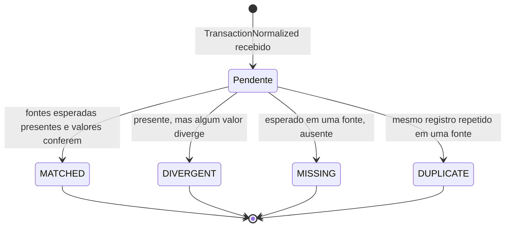
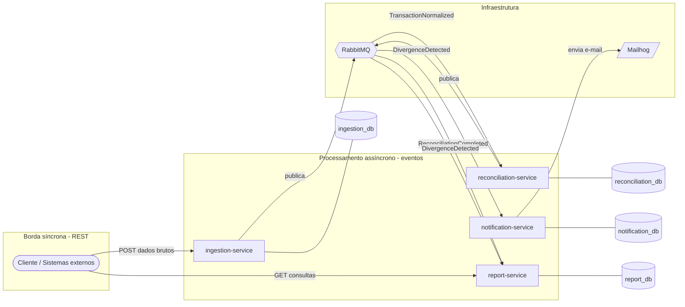
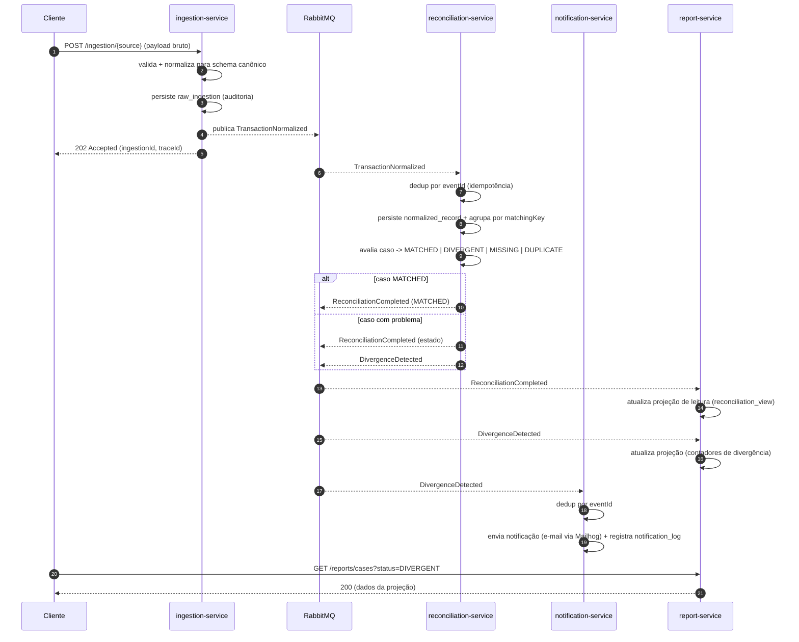

# Arquitetura — Payment Reconciliation Engine

## 1. Visão geral

O sistema concilia transações de pagamento vindas de **três fontes independentes** que, no mundo real, quase nunca concordam entre si:

1. **Gateway de pagamento** (webhook) — o que o provedor de pagamento diz que aconteceu.
2. **Extrato bancário** (importação) — o que efetivamente caiu na conta.
3. **Sistema interno de pedidos** — o que a aplicação da empresa esperava receber.

A conciliação consiste em cruzar essas visões e, para cada transação, decidir se elas batem (`MATCHED`) ou apontar o tipo de problema (`DIVERGENT`, `MISSING`, `DUPLICATE`). É um domínio clássico de *back office* financeiro e um bom terreno para demonstrar mensageria, idempotência e separação de responsabilidades.

O sistema é dividido em **quatro microsserviços** que se comunicam de forma assíncrona por eventos (RabbitMQ), com REST síncrono usado apenas na borda (cliente ↔ sistema). A justificativa de cada decisão está registrada nos [ADRs](adr/README.md).

### Estados da conciliação

> Os estados são o **resultado** da avaliação de um *caso de conciliação* (um grupo de registros com a mesma chave). Um caso pode ser reavaliado quando chega um novo registro relacionado (ver §5).

## 2. Decisões-chave

Cada decisão tem um ADR dedicado com contexto e consequências:

| # | Decisão | ADR |
|---|---|---|
| 1 | Arquitetura de **microsserviços** (não monólito modular) | [ADR-0001](adr/0001-adocao-de-microsservicos.md) |
| 2 | **Comunicação híbrida**: mensageria entre serviços, REST só na borda | [ADR-0002](adr/0002-comunicacao-hibrida-mensageria-rest.md) |
| 3 | **Database per Service** + escopo do módulo common-events | [ADR-0003](adr/0003-database-per-service.md) |
| 4 | **CQRS parcimonioso** no report-service | [ADR-0004](adr/0004-cqrs-no-report-service.md) |

Princípios transversais que guiam o design:

- **Desacoplamento por evento.** Nenhum serviço de processamento chama outro via REST. A dependência é apenas sobre o *contrato* da mensagem, não sobre a disponibilidade do outro serviço.
- **Idempotência no consumo.** Todo consumidor deduplica por `eventId`, porque RabbitMQ entrega *at-least-once* (a mesma mensagem pode chegar duas vezes).
- **Ingestão burra, núcleo inteligente.** O ingestion-service só valida e normaliza; toda a regra de conciliação vive no reconciliation-service.
- **Rastreabilidade.** Um `traceId` nasce na borda (ingestion) e é propagado no envelope de todos os eventos derivados, permitindo seguir uma transação ponta a ponta.

## 3. Mapa de serviços

Pontos a observar no diagrama:

- **REST só cruza a borda** (Cliente → ingestion, Cliente → report). Não há setas REST entre serviços de processamento.
- **Cada serviço tem seu próprio banco.** Nenhum serviço acessa o banco de outro.
- `DivergenceDetected` tem **dois consumidores** (notification e report) — o desacoplamento por evento permite adicionar novos consumidores sem tocar no produtor.

## 4. Fluxo de eventos ponta a ponta

Observações:

- O ingestion responde **202 Accepted** imediatamente — o processamento é assíncrono. O cliente recebe um `ingestionId` e o `traceId` para acompanhar depois via report-service.
- `ReconciliationCompleted` é emitido para **todo** caso (inclusive `MATCHED`), pois alimenta a projeção de leitura. `DivergenceDetected` é emitido **só** quando há problema, porque dispara notificação.
- Roteamento, exchanges, filas e DLQ estão detalhados em [docs/events](events/README.md).

## 5. Modelo de conciliação (núcleo)

O reconciliation-service é o coração do sistema. Ele funciona assim:

1. **Recebe** um `TransactionNormalized` (um registro de *uma* fonte).
2. **Persiste** o registro em `normalized_record`.
3. **Calcula a matching key** do registro: `matchingKey = externalReference` (só ela — ver [ADR-0009](adr/0009-matching-key-external-reference.md)). A `externalReference` é o identificador comum que as três fontes carregam para a mesma transação; `amount`/`transactionDate` ficam **fora** da chave justamente para poderem ser comparados entre as legs.
4. **Agrupa** todos os registros com a mesma `matchingKey` em um `reconciliation_case`.
5. **Avalia** o caso e define o estado (precedência `DUPLICATE` > `DIVERGENT` > `MISSING` > `MATCHED`; detalhes no [ADR-0010](adr/0010-modelo-avaliacao-reconciliacao.md)):
   - `DUPLICATE` — mais de um registro da **mesma** fonte na mesma chave.
   - `DIVERGENT` — fontes presentes, mas `amount`/`currency`/`transactionDate` não conferem entre elas (`amount` comparado via `BigDecimal.compareTo`).
   - `MISSING` — falta registro de uma fonte **esperada** (política configurável; default `{GATEWAY, INTERNAL_ORDER}` — o `BANK_STATEMENT` é opcional).
   - `MATCHED` — fontes esperadas presentes e todos os presentes consistentes.
6. **Emite** `ReconciliationCompleted` sempre, e `DivergenceDetected` quando o estado não é `MATCHED`.

> **Reavaliação:** como os registros de fontes diferentes chegam em momentos diferentes, um caso pode começar como `MISSING` e depois virar `MATCHED` quando o registro que faltava chega. Cada chegada reavalia o caso e emite o resultado atualizado. Os consumidores tratam isso via idempotência + `occurredAt`/versão do caso.

## 6. Modelagem de dados (por serviço)

> **Database per Service.** Os schemas abaixo são independentes; não há chaves estrangeiras cruzando bancos. Tipos são indicativos (PostgreSQL).

### 6.1 ingestion_db

Guarda o payload cru para auditoria e reprocessamento. Não conhece nada de conciliação.

**`raw_ingestion`**

| Coluna | Tipo | Notas |
|---|---|---|
| `id` | `UUID` PK | |
| `source` | `VARCHAR` | `GATEWAY` \| `BANK_STATEMENT` \| `INTERNAL_ORDER` |
| `raw_payload` | `JSONB` | corpo original recebido |
| `status` | `VARCHAR` | `RECEIVED` \| `VALIDATED` \| `REJECTED` |
| `validation_errors` | `JSONB` | preenchido quando `REJECTED` |
| `trace_id` | `UUID` | nasce aqui, propagado nos eventos |
| `published_event_id` | `UUID` | `eventId` do `TransactionNormalized` emitido |
| `received_at` | `TIMESTAMPTZ` | |

### 6.2 reconciliation_db

Estado central da conciliação.

**`normalized_record`** — cada registro canônico recebido

| Coluna | Tipo | Notas |
|---|---|---|
| `id` | `UUID` PK | |
| `event_id` | `UUID` UNIQUE | dedup de `TransactionNormalized` (idempotência) |
| `source` | `VARCHAR` | fonte de origem |
| `external_reference` | `VARCHAR` | id comum entre as fontes |
| `amount` | `NUMERIC(19,4)` | |
| `currency` | `VARCHAR(3)` | ISO 4217 |
| `transaction_date` | `DATE` | |
| `matching_key` | `VARCHAR` | indexado; liga ao caso |
| `case_id` | `UUID` FK → `reconciliation_case.id` | |
| `trace_id` | `UUID` | |
| `received_at` | `TIMESTAMPTZ` | |

**`reconciliation_case`** — o grupo avaliado

| Coluna | Tipo | Notas |
|---|---|---|
| `id` | `UUID` PK | |
| `matching_key` | `VARCHAR` UNIQUE | |
| `status` | `VARCHAR` | `PENDING` \| `MATCHED` \| `DIVERGENT` \| `MISSING` \| `DUPLICATE` |
| `version` | `INT` | incrementa a cada reavaliação (ordenação nos consumidores) |
| `divergence_details` | `JSONB` | o que divergiu, quando aplicável |
| `created_at` | `TIMESTAMPTZ` | |
| `updated_at` | `TIMESTAMPTZ` | |

**`case_member`** — quais fontes já apareceram no caso (opcional, normaliza a avaliação)

| Coluna | Tipo | Notas |
|---|---|---|
| `case_id` | `UUID` FK | |
| `source` | `VARCHAR` | |
| `normalized_record_id` | `UUID` FK | |
| PK | (`case_id`, `source`, `normalized_record_id`) | detecta `DUPLICATE` por fonte |

> **Nota (ADR-0010):** a implementação **dispensa** a `case_member`. Tudo é derivado do `normalized_record` (que já carrega `case_id` + `source`): `DUPLICATE` = mais de um `normalized_record` com o mesmo `case_id` + `source`. Ficam 2 tabelas de domínio + `outbox`.

### 6.3 notification_db

Log das notificações enviadas (auditoria + idempotência de envio).

**`notification_log`**

| Coluna | Tipo | Notas |
|---|---|---|
| `id` | `UUID` PK | |
| `event_id` | `UUID` UNIQUE | dedup de `DivergenceDetected` |
| `case_id` | `UUID` | referência lógica (sem FK cruzando banco) |
| `channel` | `VARCHAR` | `EMAIL` (extensível) |
| `recipient` | `VARCHAR` | |
| `status` | `VARCHAR` | `SENT` \| `FAILED` |
| `payload_summary` | `JSONB` | resumo do que foi notificado |
| `trace_id` | `UUID` | |
| `sent_at` | `TIMESTAMPTZ` | |

### 6.4 report_db (projeção de leitura — CQRS)

Modelo desnormalizado, otimizado para consulta. Alimentado por eventos, nunca escrito por comando direto do cliente. Ver [ADR-0004](adr/0004-cqrs-no-report-service.md).

**`reconciliation_view`**

| Coluna | Tipo | Notas |
|---|---|---|
| `case_id` | `UUID` PK | |
| `matching_key` | `VARCHAR` | |
| `status` | `VARCHAR` | último estado conhecido |
| `last_version` | `INT` | descarta eventos fora de ordem |
| `external_reference` | `VARCHAR` | |
| `amount` | `NUMERIC(19,4)` | |
| `currency` | `VARCHAR(3)` | |
| `transaction_date` | `DATE` | |
| `sources_present` | `JSONB` | fontes já vistas |
| `divergence_details` | `JSONB` | |
| `trace_id` | `UUID` | |
| `updated_at` | `TIMESTAMPTZ` | |

**`processed_event`** — controle de idempotência da projeção

| Coluna | Tipo | Notas |
|---|---|---|
| `event_id` | `UUID` PK | ignora reprocessamento |
| `processed_at` | `TIMESTAMPTZ` | |

## 7. Qualidade e infraestrutura (a implementar)

| Área | Ferramenta | Onde entra |
|---|---|---|
| Testes unitários | JUnit 5 + Mockito | lógica de matching, validação, mapeamentos |
| Testes de integração | Testcontainers (Postgres + RabbitMQ) | fluxo publica→consome, persistência real |
| Containerização | Dockerfile por serviço | `<serviço>/Dockerfile` (multi-stage) |
| Orquestração local | docker-compose | serviços + 4 Postgres + RabbitMQ + Mailhog |
| CI/CD | GitHub Actions | build + testes a cada push/PR |
| Resiliência (bônus) | Resilience4j | retry/circuit breaker no consumo |
| Observabilidade (bônus) | Actuator + Micrometer | health, métricas |

> Detalhes de implementação (Dockerfiles, compose, pipeline) serão adicionados nas próximas fases; aqui fica registrada apenas a intenção arquitetural.
